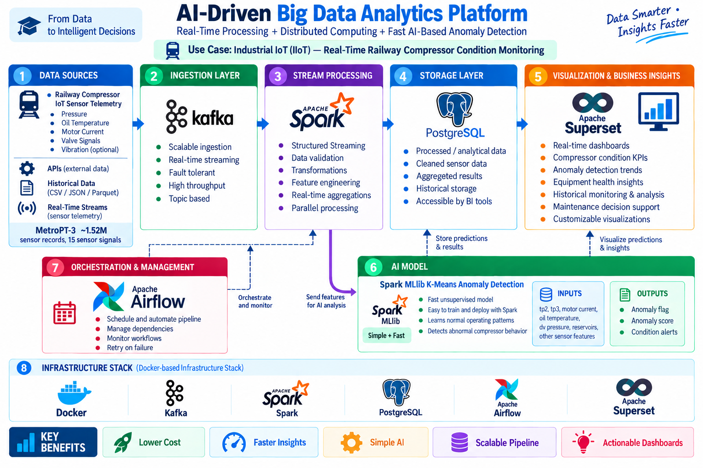
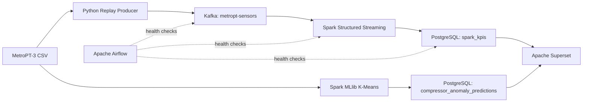

# MetroPT Real-Time Railway Compressor Monitoring

End-to-end Big Data and AI project for replaying MetroPT-3 railway compressor sensor data, processing it with Apache Kafka and Spark Structured Streaming, detecting anomalies with Spark MLlib K-Means, storing results in PostgreSQL, and visualizing insights in Apache Superset.

> **Project status:** completed academic/demo implementation. The streaming and ML components are both part of the platform; in the current implementation, K-Means scoring is executed as a Spark batch job over historical MetroPT-3 data, while the live Structured Streaming job computes operational KPIs.



## Highlights

- **Dataset:** MetroPT-3 industrial railway compressor data
- **Scale:** 1,516,948 records and 15 sensor features
- **Streaming:** Python replay producer → Kafka → Spark Structured Streaming
- **ML:** Spark MLlib K-Means anomaly detection
- **Storage:** PostgreSQL
- **Visualization:** Apache Superset
- **Orchestration:** Apache Airflow health-check DAG
- **Containerization:** Docker Compose

## Final ML Results

| Metric | Result |
|---|---:|
| Training rows | 303,959 |
| K-Means clusters | 5 |
| Anomaly threshold | 3.032087 |
| Stored predictions | 50,000 |
| Normal predictions | 49,423 |
| Anomalies | 577 |
| Average anomaly score | 1.1298 |
| Maximum anomaly score | 12.3245 |

## Architecture



## Repository Layout

```text
.
├── airflow/dags/                 # Airflow service health checks
├── assets/                       # Architecture image
├── data/                         # Dataset instructions (raw data ignored by git)
├── demo/                         # Demo flow and speaking notes
├── docker/                       # Docker Compose + Spark image
├── docs/                         # Architecture, setup and project notes
├── models/                       # Model metadata / generated model path
├── presentations/               # Project presentation
├── results/                     # Experiment/model results
├── scripts/                     # Start, stop, check and demo helpers
├── sql/                         # Database schema / inspection queries
└── src/
    ├── ml/                       # K-Means training + scoring
    ├── producer/                 # MetroPT replay producer
    └── spark/                    # Structured Streaming job
```

## Dataset

This repository does **not** commit the 208 MB dataset. Download **MetroPT-3** from the UCI Machine Learning Repository and place:

```text
data/raw/MetroPT3(AirCompressor).csv
```

Official dataset page: https://archive.ics.uci.edu/dataset/791/metropt%203%20dataset

Dataset citation:

> Davari, N., Veloso, B., Ribeiro, R., & Gama, J. (2021). MetroPT-3 Dataset. UCI Machine Learning Repository. https://doi.org/10.24432/C5VW3R

## Quick Start — Windows / PowerShell

### 1. Create a Python environment

```powershell
python -m venv .venv
.\.venv\Scripts\Activate.ps1
pip install -r requirements.txt
```

### 2. Put the dataset in place

```text
data\raw\MetroPT3(AirCompressor).csv
```

### 3. Start the core stack

```powershell
docker compose -f .\docker\docker-compose.yml up -d
```

Check services:

```powershell
docker compose -f .\docker\docker-compose.yml ps
```

### 4. Start Airflow

```powershell
docker compose `
  -f .\docker\docker-compose.yml `
  -f .\docker\docker-compose.airflow.yml `
  up -d airflow-db-init airflow
```

### 5. Run Spark Streaming

```powershell
$demoId = "demo_" + (Get-Date -Format "yyyyMMdd_HHmmss")

docker compose -f .\docker\docker-compose.yml exec spark `
  /opt/spark/bin/spark-submit `
  --master spark://spark-master:7077 `
  --conf spark.executor.memory=1024m `
  --conf spark.executor.cores=2 `
  --conf spark.cores.max=4 `
  --packages org.apache.spark:spark-sql-kafka-0-10_2.12:3.5.9 `
  /opt/project/src/spark/phase5_processing.py `
  --experiment-id $demoId `
  --window "60 seconds" `
  --trigger "5 seconds" `
  --shuffle-partitions 8 `
  --starting-offsets latest
```

### 6. Replay MetroPT sensor data

Open another PowerShell window:

```powershell
.\.venv\Scripts\python.exe -m src.producer.replay_producer `
  --mode kafka `
  --bootstrap-servers 127.0.0.1:9092 `
  --rate 10 `
  --limit 300
```

### 7. Train / score the K-Means model

```powershell
docker compose -f .\docker\docker-compose.yml exec spark `
  /opt/spark/bin/spark-submit `
  --master spark://spark-master:7077 `
  /opt/project/src/ml/train_kmeans.py
```

## Demo URLs

| Service | URL |
|---|---|
| Spark Master | http://127.0.0.1:8080 |
| Spark Driver (while app is running) | http://127.0.0.1:4040 |
| Superset | http://127.0.0.1:8088 |
| Airflow | http://127.0.0.1:8085 |

Superset demo credentials:

```text
username: admin
password: admin
```

## Kafka Verification

Describe the topic:

```powershell
docker compose -f .\docker\docker-compose.yml exec broker `
  /opt/kafka/bin/kafka-topics.sh `
  --bootstrap-server broker:19092 `
  --describe `
  --topic metropt-sensors
```

Latest offsets:

```powershell
docker compose -f .\docker\docker-compose.yml exec broker `
  /opt/kafka/bin/kafka-run-class.sh kafka.tools.GetOffsetShell `
  --broker-list broker:19092 `
  --topic metropt-sensors `
  --time -1
```

## PostgreSQL Verification

```powershell
docker compose -f .\docker\docker-compose.yml exec postgres `
  psql -U metropt -d metropt -P pager=off -c "
SELECT
  COUNT(*) AS total_predictions,
  COUNT(*) FILTER (WHERE is_anomaly = TRUE) AS anomalies,
  COUNT(*) FILTER (WHERE is_anomaly = FALSE) AS normal,
  ROUND(AVG(anomaly_score)::numeric,4) AS avg_score,
  ROUND(MAX(anomaly_score)::numeric,4) AS max_score
FROM compressor_anomaly_predictions;
"
```

## Current Scope

Included:
- Kafka ingestion
- Spark Structured Streaming
- Spark MLlib K-Means anomaly detection
- PostgreSQL persistence
- Superset dashboarding
- Airflow health checks
- Docker Compose deployment

Not part of the final architecture:
- Kubernetes
- Prometheus
- automatic Spark resource tuning / feedback loop

## Limitations and Future Work

- Current K-Means anomaly scoring is batch-based, not per-event live inference.
- Airflow currently performs orchestration/readiness health checks rather than launching the entire pipeline.
- Future work can add online model inference, alerting, model monitoring, and production deployment.

## License

Code in this repository is provided under the MIT License. The MetroPT-3 dataset has its own CC BY 4.0 license and must be cited separately.
